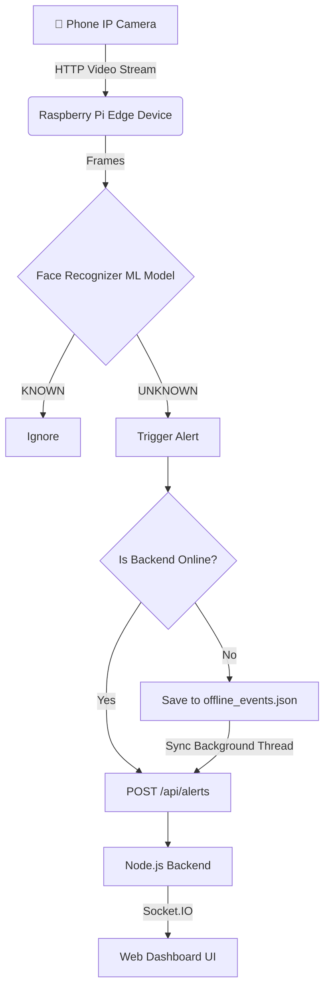

# Edge-Based Intrusion Detection System with Face Recognition

A production-ready Edge AI system that monitors a live camera feed (e.g., your smartphone), detects faces, and matches them against authorized "known" faces using Machine Learning Models. If an unknown person is detected, it triggers real-time alerts to a Node.js dashboard backend.

## 🧱 Architectural Overview



## 🎥 1. Phone Camera Setup (IP Webcam)

To use your smartphone as the IP camera:
1. Download **IP Webcam** (Android) or **EpochCam/IP Camera** (iOS).
2. Connect your phone to the same Wi-Fi network as the Raspberry Pi/Laptop.
3. Start the server in the app.
4. Note the URL displayed on the screen (e.g., `http://192.168.1.100:8080/video`).
5. Open `edge_device/config.py` and update `CAMERA_URL` to match this URL.

## 🚀 2. Deployment Flow (Raspberry Pi & Backend)

1. **Connect Raspberry Pi** to your WiFi network.
2. **Clone the repository** (after pushing to GitHub, see section below).
3. **Start the Backend server** (on your laptop or a cloud server):
   ```bash
   cd backend
   npm install
   npm start # or node server.js
   ```
   > The dashboard is now available at `http://localhost:5000`

4. **Install Edge Device dependencies** (on the Raspberry Pi):
   ```bash
   sudo apt install cmake
   cd edge_device
   pip install -r requirements.txt
   ```
5. **Add Authorized People**: 
   - Place clear photos of authorized people inside `edge_device/known_faces`. File name will be the person's name (e.g., `Salvi.jpg`).
6. **Update Config**: Edit `edge_device/config.py` and set the `BACKEND_URL` to your laptop's IP address (e.g. `http://192.168.1.50:5000/api/alerts`).
7. **Run the AI System**:
   ```bash
   python main.py
   ```

## 🌐 3. GitHub Integration (Upload to GitHub)

1. Initialize the repository:
   ```bash
   git init
   ```
2. Add all files to staging:
   ```bash
   git add .
   ```
3. Commit your changes:
   ```bash
   git commit -m "Initial commit: Edge Intrusion Detection System"
   ```
4. Link to your GitHub repository and push:
   ```bash
   git remote add origin https://github.com/your-username/intrusion-detection-system.git
   git push -u origin main
   ```

## 🧪 4. Testing

To test the alert system without a camera, we provide a simulation script:
1. Ensure the Node.js backend is running.
2. Run the simulation script:
   ```bash
   cd edge_device
   python simulate_intrusion.py
   ```
This will send an artificial `UNKNOWN` event and you should instantly see it pop up on the web dashboard.

## 🎓 Viva Explanation Guide

If asked about this project during a presentation or viva, highlight these points:
* **Edge Computing Paradigm**: The system is designed to process the heavy Computer Vision workload directly on the edge (Raspberry Pi). This saves massive amounts of bandwidth compared to streaming raw video to a server for processing.
* **AI/ML Model**: It uses Dlib's state-of-the-art Deep Learning face encodings via the `face_recognition` Python library. It creates a 128-dimension feature vector for every face it detects and uses Euclidean distance to verify the identity.
* **Fault Tolerance**: The system is highly robust. If the backend server fails or the network drops, the edge device's `OfflineQueue` caches events and attempts to sync them automatically in a background thread when connectivity is restored.
* **Real-time Push**: The Node.js backend utilizes WebSockets (`socket.io`) to instantly push alerts to the frontend client without needing the client to constantly poll the server.
