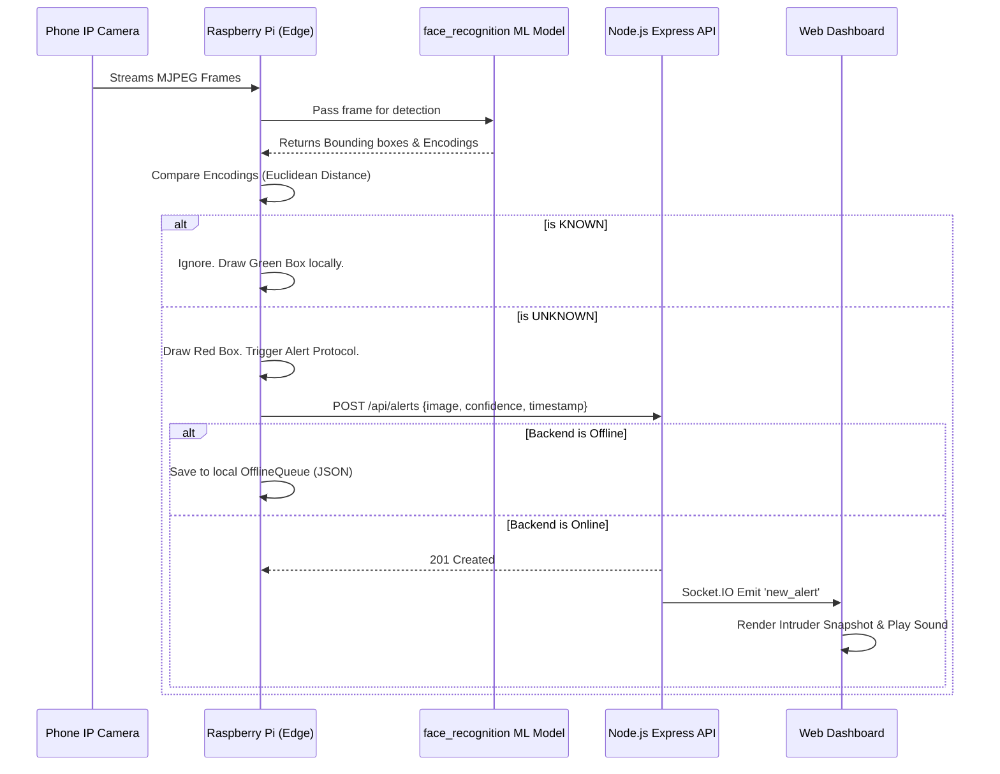

# System Architecture: Edge-Based Intrusion Detection

The system is designed following the **Edge Computing paradigm**, which shifts computation from centralized cloud servers directly to the network's "edge" (the Raspberry Pi where data is gathered).

## 1. System Components

### 1.1 IP Camera (Smartphone)
Acts as the sensory input. It captures live video frames and hosts them over the local Wi-Fi network using an MJPEG stream.

### 1.2 Edge Processing Device (Raspberry Pi)
The workhorse of the system.
- **Camera Stream Module**: Fetches frames from the IP camera URL via OpenCV (`cv2.VideoCapture`). Handles network drops gracefully.
- **Machine Learning Model (`face_recognizer.py`)**: 
  - Uses the `dlib` state-of-the-art face recognition model (accessed via the `face_recognition` library).
  - First, it detects face bounding boxes (HOG algorithm).
  - Second, it computes a 128-dimensional embedding vector for the detected face.
  - Third, it calculates the Euclidean distance between this vector and the vectors of all known faces (stored locally in `/known_faces`). 
  - If the distance is below the `FACE_MATCH_THRESHOLD` (e.g., 0.55), the face is classified as `KNOWN`. Otherwise, `UNKNOWN`.
- **Alert Sender & Offline Queue**: 
  - When an `UNKNOWN` face is detected, the `AlertSender` attempts to `POST` a JSON payload (containing the base64 intrusion snapshot and confidence) to the backend API.
  - If the backend is off or the internet disconnects, the event is immediately dumped into `offline_events.json`. A background thread continuously retries flushing this queue whenever connectivity is restored.

### 1.3 Analytics Backend (Node.js)
The brain for centralized event monitoring.
- **Express API**: Exposes `POST /api/alerts` to securely consume incoming intrusion data from any registered edge device.
- **WebSockets Server**: Utilizes `Socket.IO` to broadcast incoming alerts to all connected dashboard clients in under 100 milliseconds, establishing a true real-time push-architecture rather than relying on clunky client-polling.

### 1.4 Interactive Dashboard
- Created with premium vanilla CSS aesthetics (dark mode, glassmorphism, accent glows) to provide a "Mission Control" feel.
- Reacts instantly to Socket.IO emissions to present the bounding boxed snapshot, confidence score, device location, and timestamp to the user.

## 2. Mermaid Diagram

